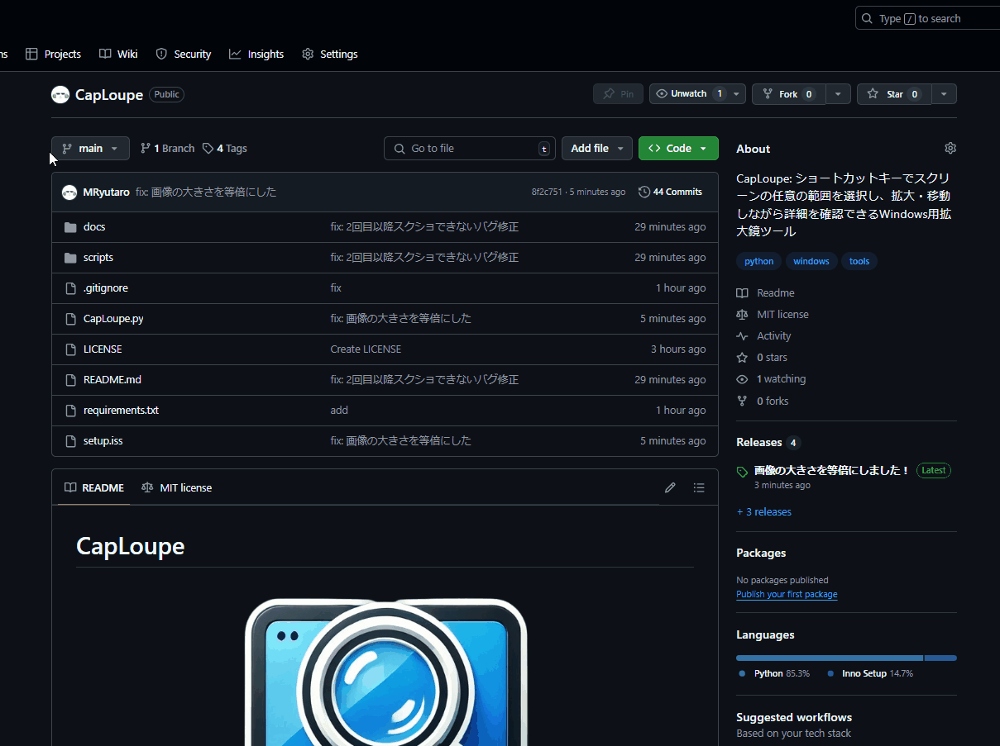

## 👋 Hi there
最終更新日：2025/03/16

  

  

  

## 🎓 経歴
| 期間 | 名前 |
|:--------|:--------|
| 2025年（令和7年）4月～2027年（令和9年）3月 | [大阪大学大学院情報科学研究科](https://www.ist.osaka-u.ac.jp/japanese/)  |
| 2021年（令和3年）4月～2025年（令和7年）3月 | [大阪大学工学部電子情報工学科](http://school.eei.eng.osaka-u.ac.jp/)  |
| 2018年（平成30）4月～2021年（令和3年）3月 | [広島市立基町高等学校](https://www.motomachi-hs.jp/)  |

| Column 1 | Column 2 |
|:--------|:--------|
| Test 1  | Test 2  |
| Test 3  | Test 4  |

## 🏢 バイト・インターン
| 期間 | 名前 | 形態 |
|:---|:---|:---|
| 2023年（令和5年）4月～2025年（令和7年）2月現在 | [くろねこラボ合同会社](https://www.knlab.co.jp/) | フルリモート |
| 2022年（令和4年）4月～2023年（令和5年）3月 | [大阪ヒートクール株式会社](https://www.osaka-heat-cool.com/) | ハイブリッド |
| 2021年（令和3年）4月～2022年（令和4年）3月 | [田中学習会](https://www.tanakagakushukai.com/) | オフィス |

## 📜 資格
| 年月 | 名前 |
|:---|:---|
| 2024年（令和6年）4月 | TOEIC Listening & Reading Test 835点 |
| 2022年（令和4年）3月 | 日商簿記検定試験3級 |
| 2021年（令和3年）6月 | ITパスポート |

## 🚀 プロジェクト
### 📌　[データ活用社会創成プラットフォームmdx](https://mdx.jp/about/mdx)を使った研究開発環境の整備
mdxの仮想マシン上で以下のソフトウェアの環境構築を行った。
| サービス名 | 説明 |
|:-----|:-----|
| [SoftEther VPN](https://ja.softether.org/) | オープンソースのVPNソフトウェア。以下のサービスを関係者だけが扱えるようにするために導入した。環境構築の手順を[記事](https://qiita.com/ryutarom128/items/4bbf97ad7ff12572eb43)にまとめた。 |
| [GROWI](https://growi.org/ja/) | 社内Wiki。サーバ情報などを共有するために導入した。 |
| [NextCloud](https://nextcloud.com/) | ファイル共有システム。Googleドライブの自社サーバ版のようなもの。 |

### 📌　[LCA](https://tenbou.nies.go.jp/science/description/detail.php?id=57)分析用のシミュレーションツールの開発
- React (React Flow, Jotai, MUIなど)
- Python (FastAPI, NumPy, NetworkXなど)

## 🏆 出場
### 📌 [技育CAMP2024 ハッカソン Vol.22](https://talent.supporterz.jp/events/21ff01e0-4e23-4758-9e08-b50c29c51860/)（2025年2月）

優秀賞を頂きました！

- Githubレポジトリは[こちら](https://github.com/MRyutaro/SnapNoteClip)
- 記事は[こちら](https://qiita.com/ryutarom128/items/6570a20bea69119de9bd)
- 発表用スライドは[こちら](https://speakerdeck.com/ryutarom/ji-yu-camp2024-vol-dot-22-snapnoteclip)

**使用した技術**
- JavaScript
- HTML
- CSS

### 📌 [Engineer Guild Hackathon 2024](https://event.gaishishukatsu.com/hackathon_2024_november)（2024年11月）

決勝に出場しました！

- Githubレポジトリは[こちら](https://github.com/MRyutaro/smago-map)
- 記事は[こちら](https://qiita.com/ryutarom128/items/f890cfeda6f515a2c4c8)
- 予選発表用スライドは[こちら](https://speakerdeck.com/ryutarom/egh-timu16)、決勝発表用スライドは[こちら](https://speakerdeck.com/ryutarom/engineer-guild-hackathon-2024-jue-sheng-timu16)

**使用した技術**
- Nginx
- React
- Python (FastAPI)
- Google Maps Platform
- Docker
- Cloudflare
- Raspberry Pi

### 📌 [技育CAMP2024 ハッカソン vol.14](https://talent.supporterz.jp/events/6f769c37-5709-4ddc-804e-4c4ff38d2112/)（2024年9月）

- デモは[こちら](https://geek-camp-30a2f.web.app/)
- GitHubレポジトリは[こちら](https://github.com/yope7/Geekcamp)
- 記事は[こちら](https://qiita.com/ryutarom128/items/1af6bb8dbc50a9d3a149)

**使用した技術**
- React
- Firebase

## 🧑‍💻 個人・共同開発
### 📌 CapLoupe（2025年2月）

- GitHubレポジトリは[こちら](https://github.com/MRyutaro/CapLoupe)

**使用した技術**
- Python
- Inno Setup

### 📌 キルした時刻を自動予測するゲーム解析用ツール（2024年9月）

- 記事は[こちら](https://qiita.com/ryutarom128/items/2016c1567208ff38d461)
- GitHubレポジトリは[こちら](https://github.com/MRyutaro/splatoon3_highlight_collector)

**使用した技術**
- React (Jotai, MUI)
- Python (FastAPI, scikit-learn)

### 📌 カメラと両手のみを必要とする新たな入力システム（2024年1月）

- GitHubレポジトリは[こちら](https://github.com/MRyutaro/finger_input_system)

**使用した技術**
- Python (matplotlib, mediapipe, numpy, opencv, pandas, scikit-learn)

### 📌 タスク管理×報酬管理×メモアプリ（2023年10月）

**使用した技術**
- Python (Django)
- CSS (Bootstrap)

## 📝 記事
| 投稿日 | タイトル |
|:---|:---|
| 2025/02/18 | [【ハッカソン】技育CAMP2024 Vol.22で優秀賞を受賞しました！](https://qiita.com/ryutarom128/items/6570a20bea69119de9bd) |
| 2024/11/18 | [Engineer Guild Hackathon 2024に出場しました！](https://qiita.com/ryutarom128/items/f890cfeda6f515a2c4c8) |
| 2024/10/07 | [【BlockNote入門】ReactでNotion風のメモアプリを作る方法](https://qiita.com/ryutarom128/items/ff451cd57771a52f6599)|
| 2024/09/28 | [FastAPIを使って認証をしてみた](https://qiita.com/ryutarom128/items/e257d45a67ffd85da31e) |
| 2024/09/24 | [【初ハッカソン】技育CAMP2024 ハッカソン vol.14に出場しました！](https://qiita.com/ryutarom128/items/1af6bb8dbc50a9d3a149) |
| 2024/09/03 | [【React×FastAPI×機械学習】キルした時刻を自動予測するゲーム解析用ツールを開発してみた](https://qiita.com/ryutarom128/items/2016c1567208ff38d461) |
| 2024/06/03 | [【KVM入門⑤】〜LDAPを使ってユーザ情報などを一元管理する〜](https://qiita.com/ryutarom128/items/b008ca44b7265164879c) |
| 2024/06/02 | [【KVM入門④】〜NFSを使って全ての仮想マシンでファイルを共有する〜](https://qiita.com/ryutarom128/items/3d66f1a5d61c3eb4e426) |
| 2024/06/02 | [【KVM入門③】〜DNSとhostsの設定を行う〜](https://qiita.com/ryutarom128/items/7dd3646beddb96dc647a) |
| 2024/06/01 | [【KVM入門②】〜複数の仮想マシンを作成して仮想マシン間で通信を行えるようにする〜](https://qiita.com/ryutarom128/items/2665a0f871d90f7f5358) |
| 2024/05/27 | [【図解】SoftEther VPNを使ってLinux上でVPNサーバの環境構築をする](https://qiita.com/ryutarom128/items/4bbf97ad7ff12572eb43) |
| 2024/05/23 | [【KVM入門①】〜KVMを使って仮想マシンを作成する〜](https://qiita.com/ryutarom128/items/a31cc4e296442cd0f9d6) |
| 2024/05/22 | [【FastAPI×React×Nginx×Docker】フロントエンドコンテナとAPIコンテナでやり取りができないときにしたこと](https://qiita.com/ryutarom128/items/25fb64d72b4bb16e6fbf) |
| 2024/05/22 | [【KVM入門⓪】〜Linuxの基礎知識〜](https://qiita.com/ryutarom128/items/00ed01b0c9dd59716964) |
| 2024/02/26 | [1年間実務経験を積んできて学んだこと（2年目）](https://qiita.com/ryutarom128/items/66d3e55bc3c7fc9704a6) |
| 2023/03/13 | [【Python×PDF】PyPDF2はもう古い！PythonでPDFを扱うときにはpypdfを使おう](https://qiita.com/ryutarom128/items/6e5d36efb136f9595f07) |
| 2023/03/09 | [【初心者向け】OpenCV, NumPyを使ってSplatoonの解析をしてみる](https://qiita.com/ryutarom128/items/3cd338ea19fcb13ff013) |
| 2023/02/26 | [プログラミング初心者の状態から1年間実務経験を積んできて学んだこと](https://qiita.com/ryutarom128/items/be0ccca1048592284d07) |

